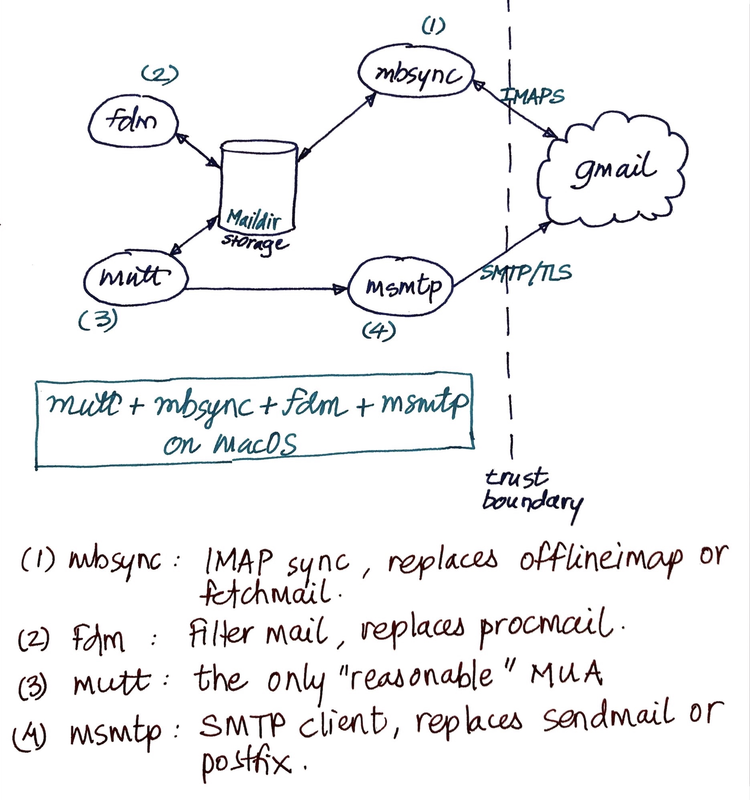

# mailhelp

Config and dot files for mutt-based setup on macOS for gmail: mutt, mbsync, fdm, msmtp. mutt, mbsync and msmtp installed through brew, while fdm compiled from source.

### [mutt](http://www.mutt.org/)
A reasonable mail client (MUA).

### [mbsync](https://isync.sourceforge.io)
Short for mailbox sync. allows sync'ing remote IMAP mailboxes with local 
storage. While mutt supports IMAPS, the latency is irritating and wanted 
my mail offline, in case gmail decides to lock me out one day. mbsync is 
an alternative to offlineimap and fetchmail.

### [fdm](https://github.com/nicm/fdm)
Short for fetch and deliver mail. Powerful, config driven fetch and 
deliver utility that can fetch mail as well as deliver it to local 
folders. Since mbsync fetches mail, fdm delivers it to local maildir 
folders, based on fiter rules. fdm is an alternative for procmail.

### [msmtp](https://marlam.de/msmtp/)
SMTP client that talks with gmail. Mutt has SMTP support, but again, the 
latency is irritating. msmtp is an excellent alternative to a 
full-fledged MTA like sendmail or postfix.

## Setup on macOS
mutt, mbsync (isync) and msmtp can be installed through brew. fdm 
requires compiling from source.

## Architecture
Roughly looks like this:

